<meta content="text/html; charset=UTF-8" http-equiv="content-type">

AJACS徳島 ドキュメント

化合物データベース（Pubchem,ChEMBL） 

化合物データベース

参考サイト

PubChem

PubChemの説明

PubChem CompoundとSubstance

インターフェイスがこの３月に更新されました。

ウェブからの検索

キーワード検索から：遺伝子名：ACADM

コマンドラインからの検索

PubChem Classification Browser

ChEMBL

ChEMBLの説明

ウェブから

含まれるデータの概要

Compounds

機能の説明

表示切り替え

絞り込み

データダウンロード

Assays

targets

キーワード検索（化合物・医薬品）

キーワード検索（遺伝子名）

コマンドラインから

化合物データベース
==================================

* [https://github.com/AJACS-training/AJACS70/tree/master/03_yamada](https://www.google.com/url?q=https://github.com/AJACS-training/AJACS70/tree/master/03_yamada%23%25E5%258C%2596%25E5%2590%2588%25E7%2589%25A9%25E3%2583%2587%25E3%2583%25BC%25E3%2582%25BF%25E3%2583%2599%25E3%2583%25BC%25E3%2582%25B9&sa=D&ust=1559207769785000)

参考サイト
==============================

* 化合物の表記法やPubChemの使い方

* ブラウザを用いた方法について
* REST, SOAP, FTPによるデータ取得などについて

* [https://github.com/yamadaissaku/ChemDocsJP](https://www.google.com/url?q=https://github.com/yamadaissaku/ChemDocsJP&sa=D&ust=1559207769786000)
* [https://github.com/yamadaissaku/ChemInfo](https://www.google.com/url?q=https://github.com/yamadaissaku/ChemInfo&sa=D&ust=1559207769786000)

* 統合TV

* PubChemを利用して化学物質やアッセイの結果を調べる 2017

* [https://togotv.dbcls.jp/20171208.html](https://www.google.com/url?q=https://togotv.dbcls.jp/20171208.html&sa=D&ust=1559207769787000)

PubChem
================================

PubChemの説明
-----------------------------------

* [Web](https://www.google.com/url?q=https://www.google.com/search?q%3Dpubchem%26oq%3Dpubchem%26aqs%3Dchrome..69i57j69i60l4j0.4321j0j4%26sourceid%3Dchrome%26ie%3DUTF-8&sa=D&ust=1559207769788000)
* [pubchemdocs](https://www.google.com/url?q=https://pubchemdocs.ncbi.nlm.nih.gov/&sa=D&ust=1559207769788000)

PubChem CompoundとSubstance
---------------------------------------------------

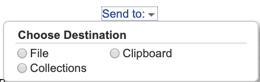

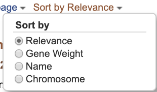

インターフェイスがこの３月に更新されました。
-----------------------------------------------

[https://pubchemdocs.ncbi.nlm.nih.gov/about](https://www.google.com/url?q=https://pubchemdocs.ncbi.nlm.nih.gov/about&sa=D&ust=1559207769790000)

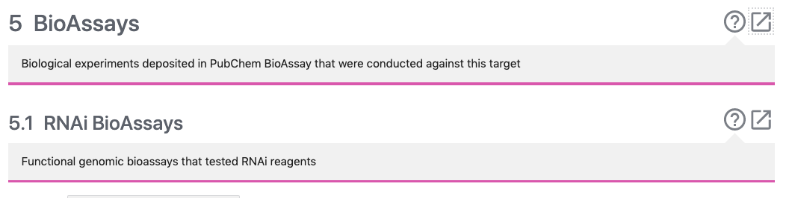

-------------------------

-------------------------

-------------------------

-------------------------

-------------------------

-------------------------

-------------------------

-------------------------

-------------------------

-------------------------

-------------------------

-------------------------

-------------------------

-------------------------

-------------------------

-------------------------

ウェブからの検索
---------------------------------

### キーワード検索から：遺伝子名：ACADM&nbsp;

1.  [中鎖アシル CoA デヒドロゲナーゼ (MCAD) 欠損症の病因遺伝子 ：ACADM ](https://www.google.com/url?q=https://www.genome.jp/dbget-bin/www_bget?ds_ja:H00488&sa=D&ust=1559207769793000)について調べてみましょう。
2.  PubChemのサイト（[https://pubchem.ncbi.nlm.nih.gov/](https://www.google.com/url?q=https://pubchem.ncbi.nlm.nih.gov/&sa=D&ust=1559207769794000)）を開きます。
3.  下図のようにキーワード入力欄に”ACADM&nbsp;”を入力すると、Compound, Gene, Taxonomyに分類された候補キーワードが示されます。

1.  今回は、"Gene"の"Acadm"をクリックすると、下図のサイトに移動します。
2.  ここでも、分類としてSubstances, Genes, BioAssays, Literature, Patentsが表示され、その下の（）内に含まれるデータの数が表示されます。

1.  ここで、"Gene"をクリックすると、taxonomy IDの異なる３個の遺伝子が含まれることがわかります。

* [9906: Homo sapiens (human) ](https://www.google.com/url?q=https://www.ncbi.nlm.nih.gov/Taxonomy/Browser/wwwtax.cgi?id%3D9606&sa=D&ust=1559207769795000)
* [10090: Mus musculus (house mouse) ](https://www.google.com/url?q=https://www.ncbi.nlm.nih.gov/Taxonomy/Browser/wwwtax.cgi?id%3D10090&sa=D&ust=1559207769796000)
* [10116: Rattus norvegicus (Norway rat) ](https://www.google.com/url?q=https://www.ncbi.nlm.nih.gov/Taxonomy/Browser/wwwtax.cgi?id%3D10116&sa=D&ust=1559207769796000)

1.  ここで、各遺伝子毎にLinked BioAssays Countが表示されています。

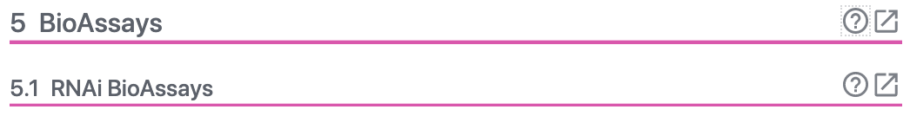

1.  Linked BioAssays Countのあとの数値、この場合は"12"をクリックすると、BioAssaysのサイトへ移動します。

1.  Linked BioAssays Countのあとの数値、この場合は"12"をクリックすると、BioAssaysのサイトへ移動します。

* BioAssay AID,&nbsp;&nbsp;&nbsp;&nbsp;&nbsp;&nbsp;&nbsp;&nbsp;BioAssay Name, BioAssay Type の表示された表が表示されます。

をクリックすると、説明が表示されます。この機能はPubChemの色々なサイトにありますので、”これ何？”と思ったら、クリックしてみてください。

1.  右上のDownloadをクリックとCSV形式で取得することができます。ダウンロードしたCSV形式のファイルを開くと以下のようになります。

1.  テーブルの”BioAssay AID”をクリックすると、以下のようなアッセイの詳細を見ることができます。

1.  詳細ページには上図のようなことが記載されています。

* ”Tested Substances:”を見ていただくと、”Active”と”Inactive”の件数がわかります。

* ”Data table”をクリックすると下記のTableが表示されます。これは、ページをスクロールすることや、ページ右端の”CONTENTS”の”2 Data Table”をクリックすることでも同様に移動できます。

1.  右上の”？”をクリックすると ここでも説明が表示されます。

1.  Data Tableには様々な情報が登録されています。右上の”SORT BY”のプルダウンにより、Activity, Score, SID, CID

1.  右上のDownloadをクリックとCSV形式で取得することができます。また、Data Tableのダウンロードでは、下図のようにALL, ACTIVE, INACTIVEをそれぞれ取得できます。

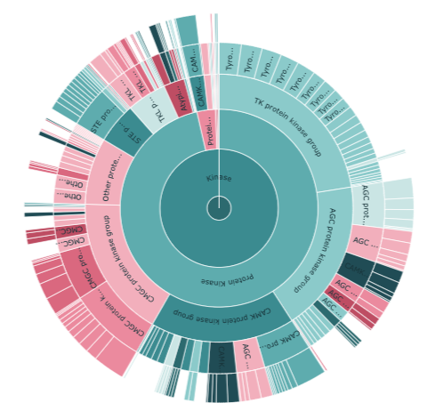

1.  取得したCSV形式のファイルを開くと以下のようになります。

1.  Data Tableからのリンクは、SID, Activity, Entrez GeneIDから、それぞれのページに移動することができます。
2.  Data Tableの各列のSIDのSID（例えば：152153881）をクリックすると下図のようなページが表示されます。

1.  このページでは、Depositor CommentsやSIDに関するBiological Test Resultsを得ることができます。

1.  Data Tableの各列のActivityのActive or Inactiveをクリックすると下図のようなページが表示されます。

1.  Data Tableの各列のEntrez GeneIDをクリックすると下図のようなページが表示されます。このページでは、遺伝子に関する各種情報を見ることができます。

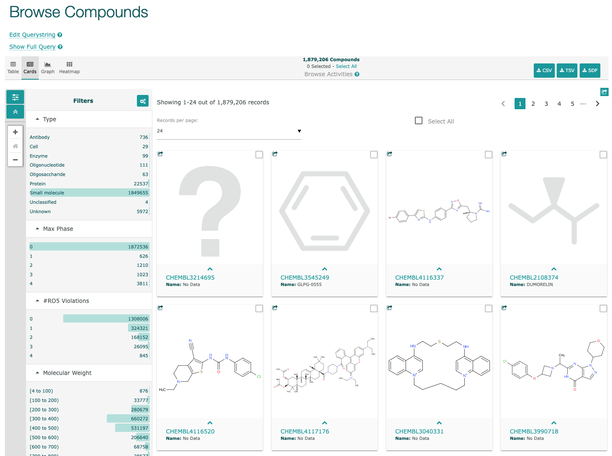

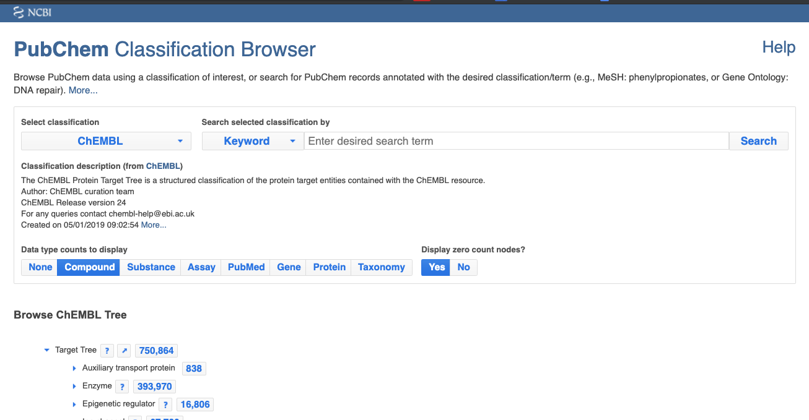

コマンドラインからの検索
-------------------------------------

* [https://pubchem.ncbi.nlm.nih.gov/gene/ACADM/human](https://www.google.com/url?q=https://pubchem.ncbi.nlm.nih.gov/gene/ACADM/human&sa=D&ust=1559207769803000)
* [https://pubchem.ncbi.nlm.nih.gov/protein/P00533](https://www.google.com/url?q=https://pubchem.ncbi.nlm.nih.gov/protein/P00533&sa=D&ust=1559207769804000)

PubChem Classification Browser
-------------------------------------------------------

* [https://pubchem.ncbi.nlm.nih.gov/classification/#hid=1](https://www.google.com/url?q=https://pubchem.ncbi.nlm.nih.gov/classification/%23hid%3D1&sa=D&ust=1559207769805000)

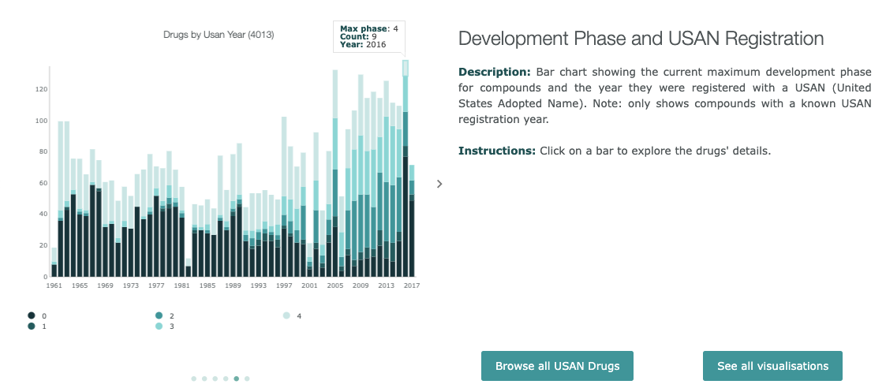

1.  Select classificationで、”ChEMBL”を選択してください。

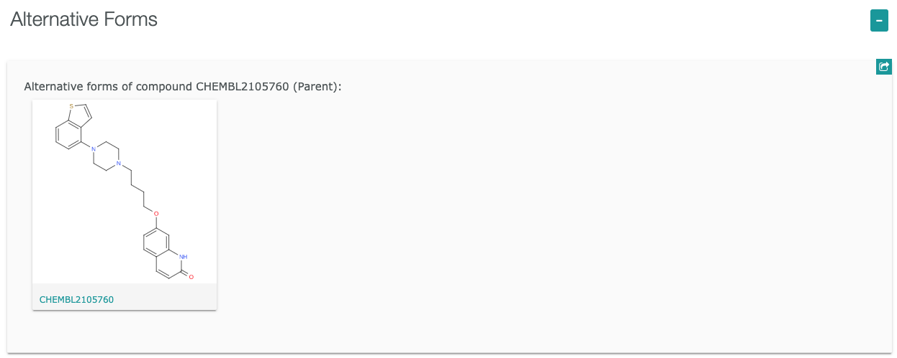

1.  Data type counts to display の下に、None, Compound, Substance, Assay, PubMed, Gene, Protein, Taxonomy が表示されました。
2.  AssayやGeneを選択すると、以下のように項目に含まれる数値が変わります。
3.  

ChEMBL
===============================

ChEMBLの説明
----------------------------------

[https://github.com/Mishima-syk/py4chemoinformatics/blob/master/ch04_database.asciidoc](https://www.google.com/url?q=https://github.com/Mishima-syk/py4chemoinformatics/blob/master/ch04_database.asciidoc&sa=D&ust=1559207769808000)

ChEMBL Interface Questions

* [https://chembl.gitbook.io/chembl-interface-documentation/frequently-asked-questions/chembl-interface-questions#can-i-edit-the-query-being-used](https://www.google.com/url?q=https://chembl.gitbook.io/chembl-interface-documentation/frequently-asked-questions/chembl-interface-questions%23can-i-edit-the-query-being-used&sa=D&ust=1559207769808000)

### ウェブから

[https://www.ebi.ac.uk/chembl/](https://www.google.com/url?q=https://www.ebi.ac.uk/chembl/&sa=D&ust=1559207769809000)

#### 含まれるデータの概要

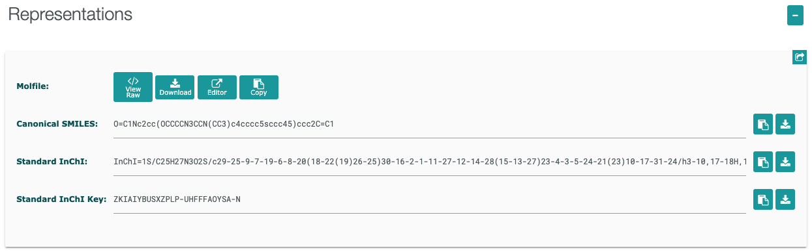

分類

クリックすることで分類を見ることができる。

分子の種類と承認の時系列

Taxonomyによる分類

開発フェーズとUSAN登録

疾患

#### Compounds

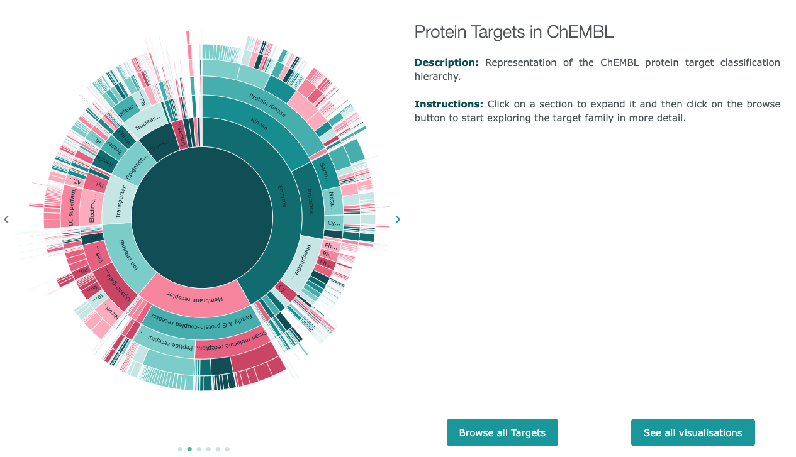

##### 機能の説明

###### 表示切り替え

* 左上のTable, Card, Graph, Heatmapをクリックすると表示を切り替えることができます。
* 

###### 絞り込み

* Filterから絞りたい項目をクリックして選択すると、データを絞り込むことができます。
* 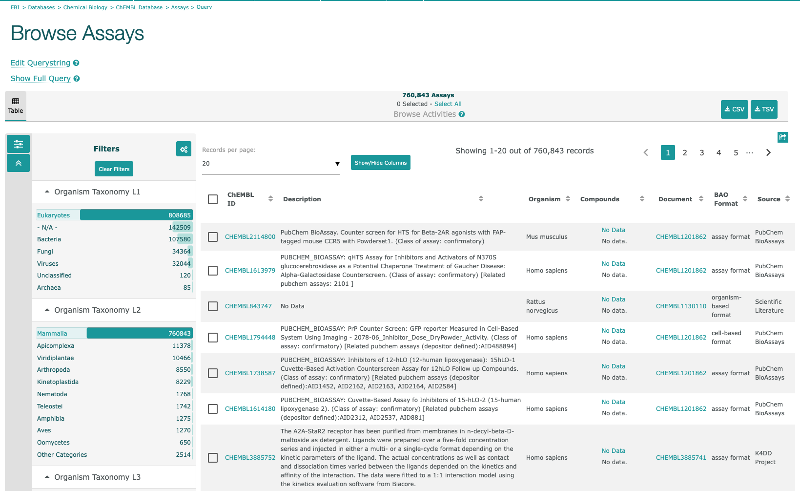
* で、フィルターをクリアすることができます。

###### データダウンロード

* 右上のアイコンからダウンロートする形式を選んで選択したデータをダウンロードすることができます。
* 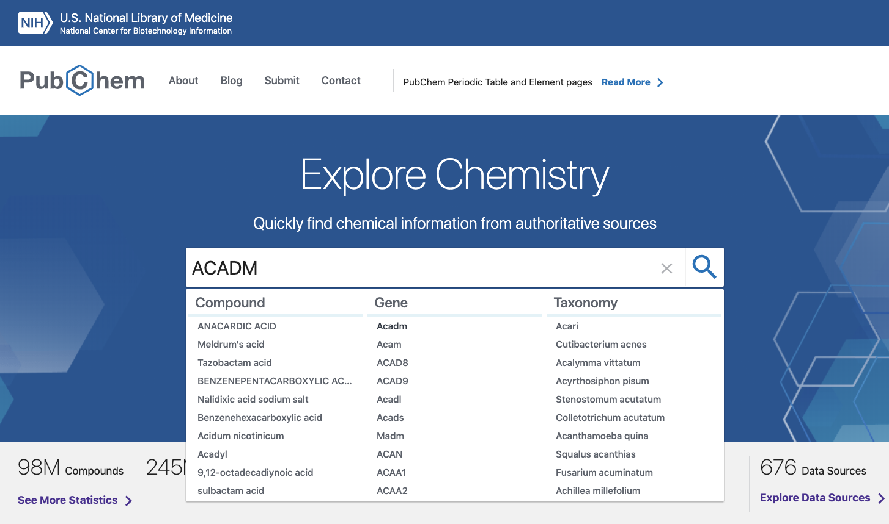
* 

#### Assays

クリック

#### targets

Organism: Homo Sapiens, Protein Classification L2: Kinase

エントリーをクリック

### キーワード検索（化合物・医薬品）

レキサルティ

[https://www.kegg.jp/medicus-bin/japic_med?japic_code=00067274](https://www.google.com/url?q=https://www.kegg.jp/medicus-bin/japic_med?japic_code%3D00067274&sa=D&ust=1559207769828000)

“Brexpiprazole”を検索してみましょう

からCompoundsに含まれているデータであることがわかります。

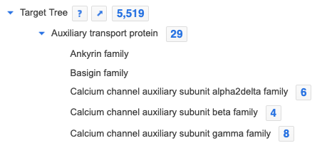をクリックすると分子の詳細ページが表示されます。

[https://www.ebi.ac.uk/chembl/compound_report_card/CHEMBL2105760/](https://www.google.com/url?q=https://www.ebi.ac.uk/chembl/compound_report_card/CHEMBL2105760/&sa=D&ust=1559207769829000)

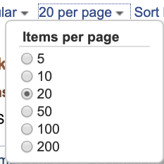

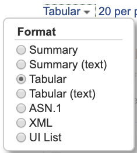

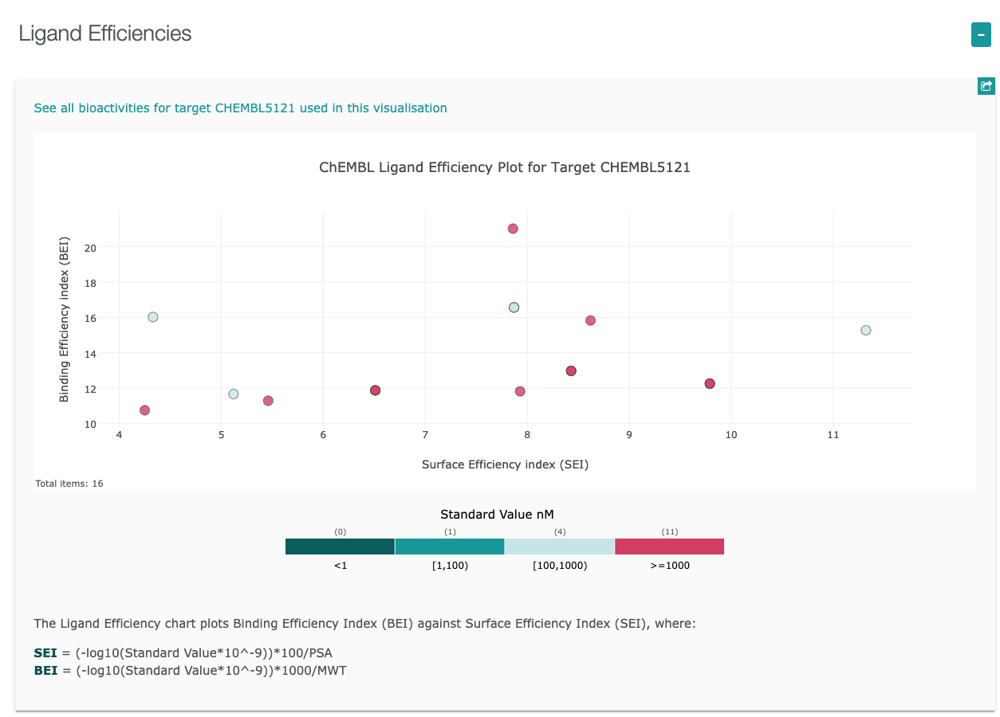

### [キーワード検索](https://www.google.com/url?q=https://www.ebi.ac.uk/chembl/&sa=D&ust=1559207769831000)（遺伝子名）

MAPK6遺伝子

ヒトでマイトジェン活性化プロテインキナーゼ6をコードするMAPK6遺伝子

からTargetsに含まれていることがわかります。

をクリックすると[詳細ページ](https://www.google.com/url?q=https://www.ebi.ac.uk/chembl/target_report_card/CHEMBL5121/&sa=D&ust=1559207769832000)へ移動します。

ここで、マウスカーソルをKdにのせて、クリックすると詳細データが表示されます。

各プロットにマウスカーソルをのせると、プロットの情報が表示されます。

BEI / Binding Efficiency Index / 結合効率指数

SEI / Surface-binding Efficiency Index / 表面結合効率指数

### コマンドラインから

[http://mishima-syk.github.io/mishimasyk/2014/01/18/ChEMBL-Redmine.html](https://www.google.com/url?q=http://mishima-syk.github.io/mishimasyk/2014/01/18/ChEMBL-Redmine.html&sa=D&ust=1559207769837000)

    

